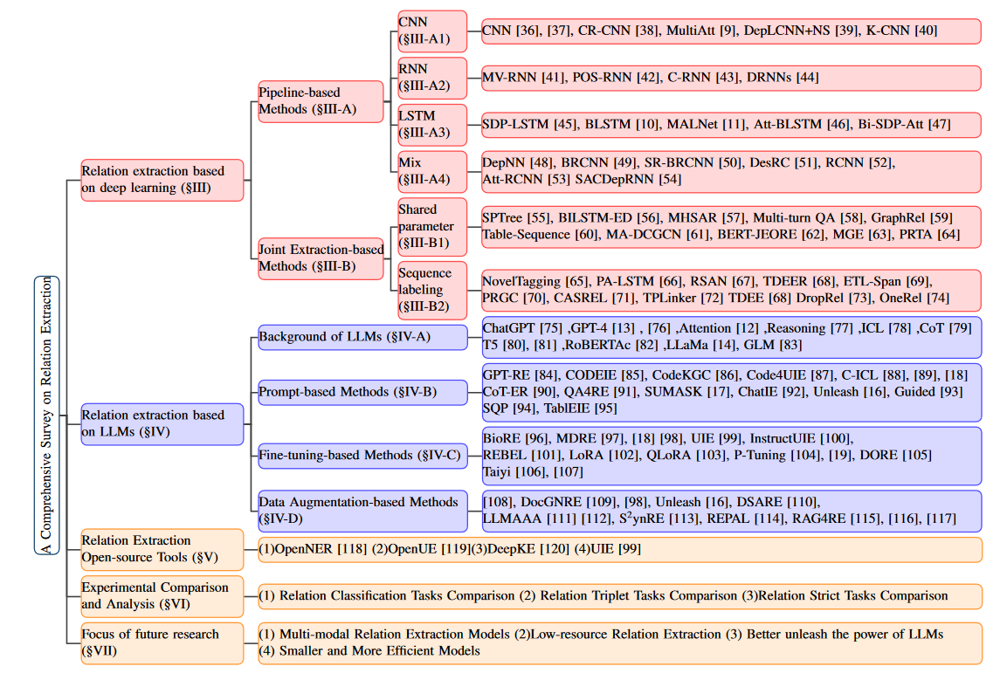

# A Survey of Relation Extraction: From Deep Learning to Large Language Models

The organization of papers is discussed in our survey: A Survey of Relation Extraction: From Deep Learning to Large Language Models]

    
## 📒 Table of Contents
- [Problem Definition](#Problem-Definition)
- [Datasets](#Datasets)
- [Evaluation Metrics](#Evaluation-Metrics)
- [Relation extraction based on deep learning](#Relation-extraction-based-on-deep-learning)
    - [Pipeline-based Methods](#Pipeline-based-Methods)
    - [Joint Extraction-based Methods](#Joint-Extraction-based-Methods)
- [Relation extraction based on LLMs](#Relation-extraction-based-on-LLMs)
     - [Prompt-based Methods](#Prompt-based-Methods)
     - [Fine-tuning-based Methods](#Fine-tuning-based-Methods)
     - [Data Augmentation-based Methods](#Data-Augmentation-based-Methods)
- [Relation Extraction Open-source Tools](#Relation-Extraction-Open-source-Tools)

# Problem Definition

# Datasets
We have summarized the commonly used datasets for RE tasks through an extensive survey of the existing literature.To assist readers, the table includes the domain, dataset sizes, and corresponding links for each dataset.

<table>
    <thead>
        <tr>
            <th align="center">Dataset</th>
            <th align="center">Domain</th>
            <th align="center">#Class</th>
            <th align="center">#Train</th>
            <th align="center">#Val</th>
            <th align="center">#Test</th>
            <th align="center">Link</th>
        </tr>
    </thead>
    <tbody>
        <tr>
            <td align="center">SemEval-2010 Task 8</td>
            <td align="center">General</td>
            <td align="center">19</td>
            <td align="center">6507</td>
            <td align="center">-</td>
            <td align="center">2717</td>
            <td align="center"><a href="https://aclanthology.org/S10-1006/">Link</a></td>
        </tr>
        <tr>
            <td align="center">ACE05</td>
            <td align="center">News</td>
            <td align="center">6</td>
            <td align="center">10051</td>
            <td align="center">2424</td>
            <td align="center">2050</td>
            <td align="center"><a href="https://catalog.ldc.upenn.edu/LDC2006T06">Link</a></td>
        </tr>
        <tr>
            <td align="center">CoNLL04</td>
            <td align="center">News</td>
            <td align="center">6</td>
            <td align="center">1153</td>
            <td align="center">288</td>
            <td align="center">288</td>
            <td align="center"><a href="https://cogcomp.seas.upenn.edu/page/resource view/43">Link</a></td>
        </tr>
        <tr>
            <td align="center">NYT</td>
            <td align="center">News</td>
            <td align="center">24</td>
            <td align="center">56195</td>
            <td align="center">5000</td>
            <td align="center">5000</td>
            <td align="center"><a href="https://iesl.cs.umass.edu/riedel/ecml/">Link</a></td>
        </tr>
        <tr>
            <td align="center">WebNLG</td>
            <td align="center">General</td>
            <td align="center">246</td>
            <td align="center">5019</td>
            <td align="center">500</td>
            <td align="center">703</td>
            <td align="center"><a href="https://github.com/weizhepei/CasRel/tree/master/data/WebNLG">Link</a></td>
        </tr>
        <tr>
            <td align="center">ADE</td>
            <td align="center">Biomedical</td>
            <td align="center">1</td>
            <td align="center">3417</td>
            <td align="center">427</td>
            <td align="center">428</td>
            <td align="center"><a href="https://sites.google.com/site/adecorpus/">Link</a></td>
        </tr>
        <tr>
            <td align="center">SciERC</td>
            <td align="center">Scientific</td>
            <td align="center">7</td>
            <td align="center">1861</td>
            <td align="center">275</td>
            <td align="center">551</td>
            <td align="center"><a href="https://nlp.cs.washington.edu/sciIE/">Link</a></td>
        </tr>
        <tr>
            <td align="center">TACRED</td>
            <td align="center">News</td>
            <td align="center">42</td>
            <td align="center">68124</td>
            <td align="center">22631</td>
            <td align="center">15509</td>
            <td align="center"><a href="https://nlp.stanford.edu/projects/tacred/">Link</a></td>
        </tr>
        <tr>
            <td align="center">Re-TACRED</td>
            <td align="center">News</td>
            <td align="center">40</td>
            <td align="center">58465</td>
            <td align="center">19584</td>
            <td align="center">13418</td>
            <td align="center"><a href="https://github.com/gstoica27/Re-TACRED">Link</a></td>
        </tr>
        <tr>
            <td align="center">TACREV</td>
            <td align="center">News</td>
            <td align="center">42</td>
            <td align="center">68124</td>
            <td align="center">22631</td>
            <td align="center">15509</td>
            <td align="center"><a href="https://github.com/DFKI-NLP/tacrev">Link</a></td>
        </tr>
        <tr>
            <td align="center">DocRED</td>
            <td align="center">Document-level</td>
            <td align="center">96</td>
            <td align="center">3053</td>
            <td align="center">1000</td>
            <td align="center">1000</td>
            <td align="center"><a href="https://github.com/thunlp/DocRED">Link</a></td>
        </tr>
        <tr>
            <td align="center">Re-DocRED </td>
            <td align="center">Document-level</td>
            <td align="center">96</td>
            <td align="center">3053</td>
            <td align="center">500</td>
            <td align="center">500</td>
            <td align="center"><a href="https://github.com/tonytan48/Re-DocRED">Link</a></td>
        </tr>
        <tr>
            <td align="center">CodRED</td>
            <td align="center">Document-level</td>
            <td align="center">-</td>
            <td align="center">-</td>
            <td align="center">-</td>
            <td align="center">-</td>
            <td align="center"><a href="https://github.com/thunlp/CodREDv">Link</a></td>
        </tr>
        <tr>
            <td align="center">DocRED-HWE</td>
            <td align="center">Document-level</td>
            <td align="center">-</td>
            <td align="center">-</td>
            <td align="center">-</td>
            <td align="center">-</td>
            <td align="center"><a href="https://github.com/Hytn/DocRED-HWE">Link</a></td>
        </tr>
        <tr>
            <td align="center">REFinD  </td>
            <td align="center">Finance </td>
            <td align="center">22</td>
            <td align="center">20070</td>
            <td align="center">4306</td>
            <td align="center">4300</td>
            <td align="center"><a href="https://refind-re.github.io/index.html">Link</a></td>
        </tr>
        <tr>
            <td align="center">MNRE</td>
            <td align="center">Multi-modal</td>
            <td align="center">31</td>
            <td align="center">12247</td>
            <td align="center">1624</td>
            <td align="center">1614</td>
            <td align="center"><a href="https://github.com/thecharm/MNRE">Link</a></td>
        </tr>
        <tr>
            <td align="center">MNRE*</td>
            <td align="center">Multi-modal</td>
            <td align="center">23</td>
            <td align="center">12247</td>
            <td align="center">1624</td>
            <td align="center">1614</td>
            <td align="center"><a href="https://github.com/thecharm/Mega">Link</a></td>
        </tr>
        <tr>
            <td align="center">CAIL</td>
            <td align="center">Legal</td>
            <td align="center">4 </td>
            <td align="center">1400</td>
            <td align="center">-</td>
            <td align="center">250</td>
            <td align="center"><a href="https://github.com/DUTIR-LegalIntelligence/JointExtraction4Legal">Link</a></td>
        </tr>
        <tr>
            <td align="center">FewRel</td>
            <td align="center">Low-resource</td>
            <td align="center">100</td>
            <td align="center"> 56000</td>
            <td align="center">14000</td>
            <td align="center">14000</td>
            <td align="center"><a href="https://github.com/thunlp/FewRel">Link</a></td>
        </tr>
        <tr>
            <td align="center">Wiki-ZSL</td>
            <td align="center">Low-resource </td>
            <td align="center">113</td>
            <td align="center">-</td>
            <td align="center">-</td>
            <td align="center">-</td>
            <td align="center"><a href="https://github.com/dinobby/ZS-BERT">Link</a></td>
        </tr>
        <tr>
            <td align="center">ADE</td>
            <td align="center"> Biomedical</td>
            <td align="center">1 </td>
            <td align="center">3417 </td>
            <td align="center"> 427</td>
            <td align="center">428</td>
            <td align="center"><a href="https://sites.google.com/site/adecorpus/">Link</a></td>
        </tr>
        <tr>
            <td align="center">ChemProt</td>
            <td align="center">Biochemical</td>
            <td align="center">14</td>
            <td align="center"> 19460 </td>
            <td align="center">11820</td>
            <td align="center">16943 </td>
            <td align="center"><a href="https://github.com/allenai/scibert">Link</a></td>
        </tr>
        <tr>
            <td align="center">DDI </td>
            <td align="center">Biochemical </td>
            <td align="center">5</td>
            <td align="center">18,779</td>
            <td align="center">7244</td>
            <td align="center">5761</td>
            <td align="center"><a href="https://github.com/albertrial/SemEval-2013-task-9">Link</a></td>
        </tr>
    </tbody>
</table>

# Evaluation Metrics

# Relation extraction based on deep learning 
This section provides a detailed introduction to two deep learning-based RE methods: pipeline-based and joint extraction-based methods.
## Pipeline-based Methods
|  Paper  |      Dataset | Evaluation Metrics    | Code |
| :----- | :--------------: |:---------: | :---------: |
|  [Relation classification via convolutional deep neural network](https://aclanthology.org/C14-1220/)  |   SemEval-2010 Task 8      | macro-F1     |  [GitHub](https://github.com/onehaitao/CNN-relation-extraction)|
|  [Relation extraction: Perspective from convolutional neural networks](https://aclanthology.org/W15-1506/)  | SemEval-2010 Task 8  |P R macro-F1     | 
|  [Classifying relations by ranking with convolutional neural networks](https://aclanthology.org/P15-1061/)  | SemEval-2010 Task 8   | P R macro-F1      | [GitHub](https://github.com/onehaitao/CR-CNN-relation-extraction)|
|  [Relation classification via multi-level attention CNNs](https://aclanthology.org/P16-1123/)  |  SemEval-2010 Task 8   |  macro-F1     | [GitHub](https://github.com/FrankWork/acnn)|
|  [Semantic relation classification via convolutional neural networks with simple negative sampling](https://aclanthology.org/D15-1062/) |   SemEval-2010 Task 8    | macro-F1       |  
|  [Knowledge-oriented convolutional neural network for causal relation extraction from natural language texts](https://www.sciencedirect.com/science/article/abs/pii/S0957417418305177)  |  SemEval-2010 Task 8     |   P R macro-F1    | 
|  [Semantic compositionality through recursive matrix-vector spaces](https://aclanthology.org/D12-1110/)|   SemEval-2010 Task 8    |    macro-F1     |   
|  [Simple customization of recursive neural networks for semantic relation classification](https://aclanthology.org/D13-1137/) |   SemEval-2010 Task 8    |macro-F1      | 
|  [Chain based rnn for relation classification](https://aclanthology.org/N15-1133.pdf) |   SemEval-2010 Task 8    | macro-F1    | 
|  [Improved relation classification by deep recurrent neural networks with data augmentation](https://aclanthology.org/C16-1138/) |   SemEval-2010 Task 8   | macro-F1     | 
|  [Classifying relations via long short term memory networks along shortest dependency paths](https://aclanthology.org/D15-1206/) |   SemEval-2010 Task 8    |macro-F1    | 
|  [Attention-based bidirectional long short-term memory networks for relation classification](https://aclanthology.org/P16-2034/))|   SemEval-2010 Task 8   | macro-F1     | 
|  [Attention-based lstm with filter mechanism for entity relation classification](https://www.mdpi.com/2073-8994/12/10/1729)|   SemEval-2010 Task 8     | macro-F1    | 
|  [Direction-sensitive relation extraction using bi-sdp attention model](https://www.sciencedirect.com/science/article/abs/pii/S0950705120302628) |SemEval-2010 Task 8 | macro-F1     | 
|  [A dependency-based neural network for relation classification](https://aclanthology.org/P15-2047.pdf) |   SemEval-2010 Task 8    | macro-F1     | 
|  [Bidirectional recurrent convolutional neural network for relation classification](https://aclanthology.org/P16-1072/) |   SemEval-2010 Task 8    | macro-F1      | 
|  [Neural relation classification with text descriptions](https://aclanthology.org/C18-1100/) |   SemEval-2010 Task 8    | P R macro-F1     | 
|  [A combination of rnn and cnn for attention-based relation classification](https://www.sciencedirect.com/science/article/pii/S187705091830601X) | SemEval-2010 Task 8 | macro-F1       | 
|  [A single attention-based combination of cnn and rnn for relation classification](https://ieeexplore.ieee.org/document/8606107) |   SemEval-2010 Task 8 |  macro-F1    | 
|  [Relation classification using segment-level attention-based CNN and dependency-based RNN](https://aclanthology.org/N19-1286/) |   SemEval-2010 Task 8  |  macro-F1     | 
## Joint Extraction-based Methods
|  Paper  |      Dataset     |Evaluation Metrics    | Code |
| :----- | :--------------: | :---------: |:---------: |
|  [End-to-end relation extraction using LSTMs on sequences and tree structures](https://aclanthology.org/P16-1105/) |   ACE05、ACE04、SemEval-2010 Task 8     |P R micro-F1、macro-F1 | [GitHub](https://github.com/tticoin/LSTM-ER)|
|  [Going out on a limb: Joint extraction of entity mentions and relations without dependency trees](https://aclanthology.org/P17-1085/)  |  ACE05  | P R micro-F1  |
|  [Joint entity and relation extraction based on a hybrid neural network](https://www.sciencedirect.com/science/article/abs/pii/S0925231217301613) | ACE05  | P R micro-F1  |
|  [Graphrel: Modeling text as relational graphs for joint entity and relation extraction](https://aclanthology.org/P19-1136/) |  NYT、WebNLG   | P R micro-F1  |[GitHub](https://github.com/tsujuifu/pytorch_graph-rel)|
|  [A relational adaptive neural model for joint entity and relation extraction](https://www.frontiersin.org/journals/neurorobotics/articles/10.3389/fnbot.2021.635492/full) |    NYT、WebNLG     |   P R micro-F1  |
|  [Entity-relation extraction as multi-turn question answering](https://aclanthology.org/P19-1129/)  |  ACE04、ACE05、CoNLL04   | P R micro-F1  |[GitHub](https://github.com/ShannonAI/Entity-Relation-As-Multi-Turn-QA)|
|  [Two are better than one: Joint entity and relation extraction with table-sequence encoders](https://aclanthology.org/2020.emnlp-main.133/)| ACE04、ACE05、CoNLL04、ADE  |   P R micro-F1 | [GitHub](https://github.com/LorrinWWW/two-are-better-than-one)|
|  [Joint extraction of entities and overlapping relations using source-target entity labeling](https://www.sciencedirect.com/science/article/abs/pii/S0957417421002943) |   NYT、WebNLG    |  P R micro-F1 |
|  [A multigate encoder for joint entity and relation extraction](https://aclanthology.org/2022.ccl-1.75/) |   ACE04、ACE05、SciERC   | micro-F1  |
|  [Prta:joint extraction of medical nested entities and overlapping relation via parameter sharing progressive recognition and targeted assignment decoding scheme](https://www.sciencedirect.com/science/article/abs/pii/S0010482524006231) |   NYT、ACE04、 ACE05   |    P R micro-F1   |   
|  [Joint extraction of entities and relations based on a novel tagging scheme](https://aclanthology.org/P17-1113/) |    NYT   |  P R micro-F1  |[GitHub](https://github.com/gswycf/Joint-Extraction-of-Entities-and-Relations-Based-on-a-Novel-Tagging-Scheme)|
|  [Joint extraction of entities and overlapping relations using position-attentive sequence labeling](https://ojs.aaai.org/index.php/AAAI/article/view/4591))|   NYT  | P R micro-F1   |
|  [Joint extraction of entities and relations based on a novel decomposition strategy](https://www.nature.com/articles/s41598-024-51559-w)|    NYT、WebNLG     | P R micro-F1  |[GitHub](https://github.com/yubowen-ph/JointER)|
|  [A novel cascade binary tagging framework for relational triple extraction](https://aclanthology.org/2020.acl-main.136/) |NYT、WebNLG |P R micro-F1  |[GitHub](https://github.com/weizhepei/CasRel)|
|  [Tplinker: Single-stage joint extraction of entities and relations through token pair linking](https://aclanthology.org/2020.coling-main.138/) |   NYT、WebNLG |P R micro-F1  |[GitHub](https://github.com/131250208/TPlinker-joint-extraction)|
|  [PRGC: Potential relation and global correspondence based joint relational triple extraction](https://aclanthology.org/2021.acl-long.486/) |  NYT、WebNLG     | P R micro-F1 |[GitHub](https://github.com/hy-struggle/PRGC)|
|  [A simple overlapping relation extraction method based on dropout](https://ieeexplore.ieee.org/document/9892310) |   NYT、WebNLG    | P R micro-F1  |
|  [Onerel: Joint entity and relation extraction with one module in one step](https://arxiv.org/abs/2203.05412) | NYT、WebNLG  | P R micro-F1 |[GitHub](https://github.com/China-ChallengeHub/OneRel)|
## Relation extraction based on LLMs 
Models targeting only RE tasks.
### Prompt-based Methods
|  Paper  |      Dataset     |Evaluation Metrics    | Code |
| :----- | :--------------: | :---------: |:---------: |
|  [Codeie: Large code generation models are better few-shot information extractors](https://aclanthology.org/2023.acl-long.855.pdf)|   ACE05、CoNLL04、NYT、SciERC     |  micro-F1 |[GitHub](https://github.com/artpli/CodeIE)|
|  [Codekgc: Code language model for generative knowledge graph construction](https://dl.acm.org/doi/10.1145/3641850) |  ADE、CONLL04、SciERC  | micro-F1 |[GitHub](https://github.com/zjunlp/DeepKE/blob/main/example/llm/CodeKGC/README_CN.md)|
|  [Retrieval-augmented code generation for universal information extraction](https://link.springer.com/chapter/10.1007/978-981-97-9434-8_3) | ACE05、ADE、CoNLL04、NYT  | micro-F1 |[GitHub](https://github.com/YucanGuo/Code4UIE)|
|  [C-ICL: Contrastive in-context learning for information extraction](https://aclanthology.org/2024.findings-emnlp.590/)| CoNLL04 ACE05 NYT SciERC  |micro-F1  |
|  [Zero-shot temporal relation extraction with ChatGPT](https://aclanthology.org/2023.bionlp-1.7/) |    TB-Dense、MATRES 、TDDMan | P R micro-F1  |
|  [Revisiting relation extraction in the era of large language models](https://aclanthology.org/2023.acl-long.868.pdf)  |  ADE、NYT、CoNLL04   | micro-F1  |
|  [GPT-RE: in-context learning for relation extraction using large language models](https://aclanthology.org/2023.emnlp-main.214.pdf)| Semeval、TACRED。SciERC、ACE05  |  micro-F1  |  [GitHub](https://github.com/YukinoWan/GPT-RE)|
|  [Chain of thought with explicit evidence reasoning for few-shot relation extraction](https://aclanthology.org/2023.findings-emnlp.153/) | FewRel 1.0、 FewRel 2.0  |  accuracy  |
|  [Aligning instruction tasks unlocks large language models as zero-shot relation extractors](https://aclanthology.org/2023.findings-acl.50.pdf) |   TACRED、RETACRED、TACREV、SemEval    |   P R micro-F1  |[GitHub](https://github.com/OSU-NLP-Group/QA4RE)|
|  [Revisiting large language models as zero-shot relation extractors](https://aclanthology.org/2023.findings-emnlp.459v2.pdf) |   FewRel、TACRED、TACREV、Re-TACRED|     P R micro-F1  |    
|  [Chatie: Zero-shot information extraction via chatting with ChatGPT](https://arxiv.org/abs/2302.10205) |   DuIE2.0#、NYT11-HRL  |  P R micro-F1 |[GitHub](https://github.com/cocacola-lab/ChatIE)|
|  [How to unleash the power of large language models for few-shot relation extraction?](https://aclanthology.org/2023.sustainlp-1.13/)|  TACRED TACREV RE-TACRED SciERC  | micro-F1  |[GitHub](https://github.com/zjunlp/DeepKE/tree/main/example/llm/UnleashLLMRE)|
|  [Are large language models ready for healthcare? a comparative study on clinical language understanding](https://proceedings.mlr.press/v219/wang23c.html)|   i2b2 2010-Relation、SemEval 2013-DDI     |  micro-F1  |[GitHub](https://github.com/eternityyw/llm_healthcare)|
|  [Unlocking instructive in-context learning with tabular prompting for relational triple extraction](https://aclanthology.org/2024.lrec-main.1488/) |CoNLL04、NYT| micro-F1   |

### Fine-tuning-based Methods
|  Paper  |      Dataset     |Evaluation Metrics    | Code |
| :----- | :--------------: | :---------: |:---------: |
|  [Leveraging pre-trained language models for mining microbiome-disease relationships](https://bmcbioinformatics.biomedcentral.com/articles/10.1186/s12859-023-05411-z)  |GCS  |P R F1 |
|  [Revisiting relation extraction in the era of large language models](https://aclanthology.org/2023.acl-long.868.pdf) |  CONLL04、ADE、NYT  |  micro-F1 |
|  [Does synthetic data generation of llms help clinical text mining?](https://arxiv.org/abs/2303.04360)|  GAD、EU-ADR   |P R micro-F1 |
|  [Unified structure generation for universal information extraction](https://aclanthology.org/2022.acl-long.395/) |   ACE05、NYT、WebNLG、SciERC    | micro-F1 |[GitHub](https://github.com/universal-ie/UIE)|
|  [Instructuie: Multi-task instruction tuning for unified information extraction](https://arxiv.org/abs/2304.08085)  |  ACE04、ACE05、CoNLL04、ADE、semeval、GIDS| micro-F1  |[GitHub](https://github.com/beyonderxx/instructuie)|
|  [REBEL: Relation extraction by end-to-end language generation](https://aclanthology.org/2021.findings-emnlp.204/)| CONLL04、NYT、DocRED、ADE、Re-TACRED| P R micro-F1  | [GitHub](https://github.com/Babelscape/rebel)|
|  [Do instruction-tuned large language models help with relation extraction?](https://ceur-ws.org/Vol-3577/paper15.pdf)  | REBEL |P R micro-F1 macro-F1  |
|  [AutoRE: Document-level relation extraction with large language models](https://aclanthology.org/2024.acl-demos.20/)  |  Re-DocRED |P R micro-F1   |[GitHub](https://github.com/thudm/autore)|
|  [Taiyi: a bilingual fine-tuned large language model for diverse biomedical tasks](https://arxiv.org/abs/2311.11608) |   BC5CDR、CMeIE   | micro-F1   |[GitHub](https://github.com/dutir-bionlp/taiyi-llm)|     

## Relation Extraction Open-source Tools 
Models targeting only EE tasks.
|  Paper  |    Features    | Code |
| :----- | :--------------: | :---------: |
|  [OpenNRE](https://www.mdpi.com/2306-5354/10/5/586)| Support sentence-level, documentlevel, few-shot RE. |[GitHub](https://github.com/thunlp/OpenNRE)|   
|  [OpenUE](https://bmcbioinformatics.biomedcentral.com/articles/10.1186/s12859-023-05411-z)  |  Based on PyTorch, supports efficient training and inference. |[GitHub](https://github.com/zjunlp/openue)|   
|  [DeepKE](https://aclanthology.org/2023.acl-long.868.pdf) | Supports cnSchema, low-resource, long-length, and multi-modal RE. |[GitHub](https://github.com/zjunlp/DeepKE)|   
|  [UIE](https://aclanthology.org/2022.acl-long.395/) |   Supports large-scale pre-trained models and fine-tuning on demand.    |[GitHub](https://github.com/universal-ie/UIE)|   

